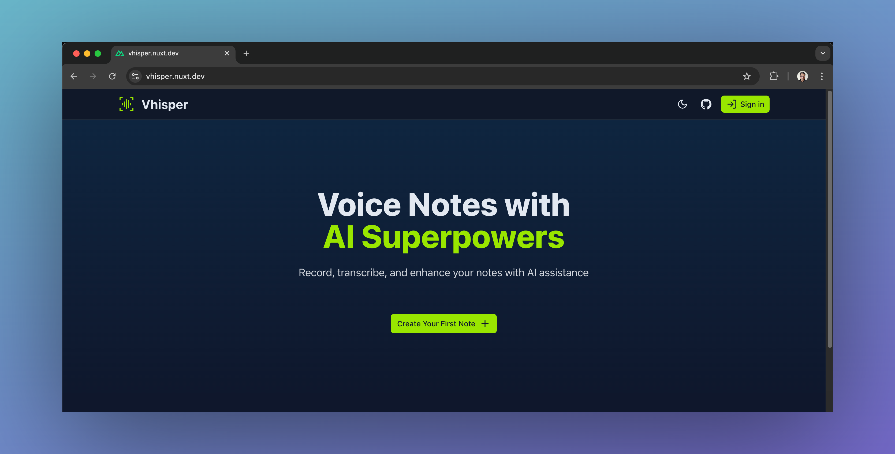
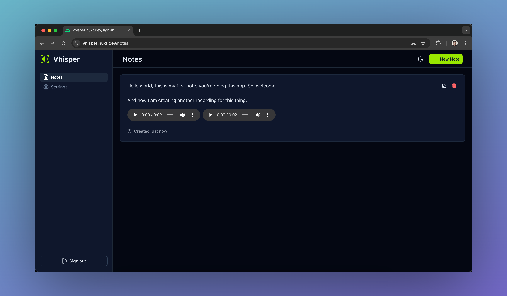
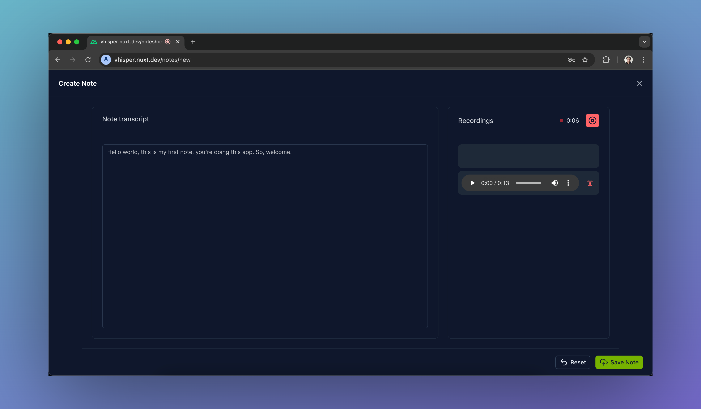

# Vhisper - In-browser Voice Notes

Vhisper is a serverless voice notes application built with Nuxt 3 that leverages various Cloudflare services through NuxtHub for it to work. It allows users to record voice notes, transcribe and post process them using AI, and manage them through a simple, intuitive interface.

## Try it Out

Live demo: <https://vhisper.nuxt.dev>

[](https://hub.nuxt.com/new?template=vhisper)



## Preview

https://github.com/user-attachments/assets/8c766706-4ed6-440d-b977-cd0f9b30f2b5

## Key Features

- **User Authentication:** Secure access with username/password.
- **Record Voice Notes:** Record multiple audio clips per note. Real-time audio visualization during recording.
- **Speech-to-Text Transcription:** Automatically transcribe recordings into text using `Whisper` AI model.
- **Post-Processing:** Optionally correct and refine transcriptions for better accuracy and clarity (`Llama 3.1` model). Local settings persistence.
- **Notes Management:** View and manage saved notes with playback for each audio recording.

Read the [associated blog post](https://rajeev.dev/building-voice-notes-app-with-ai-transcription-and-post-processing) to learn how to create this application from scratch.

## Technologies Used

- [Nuxt](https://nuxt.com): Vue.js framework for the application foundation
- [Nuxt UI (v3)](https://ui3.nuxt.com): For creating a good looking and professional frontend
- [Nuxt Auth Utils](https://github.com/atinux/nuxt-auth-utils): Module for user authentication
- [NuxtHub](https://hub.nuxt.com): Backend (`database`, `storage`, `AI` etc.), deployment and administration platform for Nuxt
- [Cloudflare](https://developers.cloudflare.com): Powers NuxtHub to provide various services

## Setup Instructions

### Prerequisites

- **Node.js (v18 or later):** Required for development and building the project.
- **Cloudflare Account:** You'll need a Cloudflare account to use Workers AI, D1, and R2 storage, and to deploy the project.
- **NuxtHub Account:** To leverage NuxtHub DX as an interface to Cloudflare

### Installation

Clone the repository and install dependencies:

```bash
pnpm install # or equivalent command
```

### Environment Setup

Before using Workers AI in development, you need to link to a NuxtHub project. This is needed as during local development also, AI models are run against your Cloudflare account. [See pricing and free quote details](https://developers.cloudflare.com/workers-ai/platform/pricing).

You can either put the NuxtHub project key manually in the `.env` file, or use the CLI to create/link a project.

```bash
NUXT_SESSION_PASSWORD=at_least_32_chars_string
NUXT_HUB_PROJECT_KEY=your_nuxthub_project_key
```

**1. Using .env file:**

- Copy .env.example to .env
- Fill in required variables
- For local development, `NUXT_SESSION_PASSWORD` will be auto-generated if not provided

**2. Using NuxtHub CLI:**

```bash
npx nuxthub link
```

This will:

- Create/link a NuxtHub project
- Set up necessary Cloudflare resources
- Configure `NUXT_HUB_PROJECT_KEY` automatically

## Usage

### Running the Development Server

```bash
pnpm dev
```

### Notes Page



### Note Creation Page



The app will be available at `http://localhost:3000`.

## Deployment

[](https://hub.nuxt.com/new?template=vhisper)

Once you're ready, you can deploy using either the following ways:

### Deploy via NuxtHub Admin

- Push your code to a GitHub repository.
- Link the repository with NuxtHub.
- Do not forget to add the environment variables (you only need to add the session password)
- Deploy from the Admin console.

[Learn more about Git integration](https://hub.nuxt.com/docs/getting-started/deploy#cloudflare-pages-ci)

### Deploy via NuxtHub CLI

```bash
npx nuxthub deploy
```

[Learn more about CLI deployment](https://hub.nuxt.com/docs/getting-started/deploy#nuxthub-cli)

## Contributing

Contributions are welcome! If you find any issues or want to add new features, feel free to fork the repo, create a branch, and submit a pull request.

## License

This project is licensed under the MIT License - see the LICENSE file for details.
